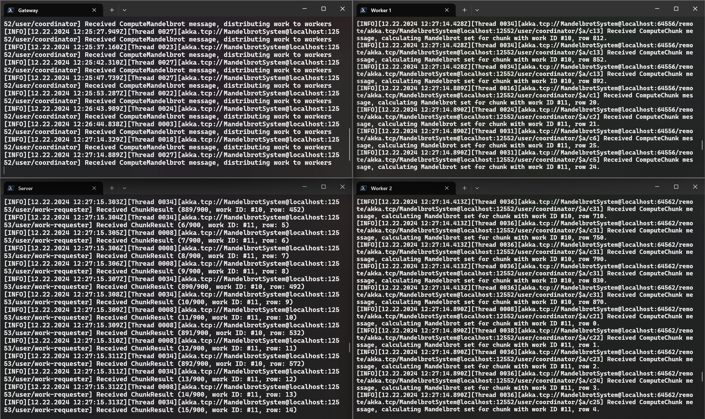

# PDI 2024/2025Z - Project – Distributed Mandelbrot Set Calculator

Autor: Bc. Tomáš Milostný (xmilos02)

## Overview

This project is a distributed Mandelbrot set calculator with a REST API built using .NET 9 and a Blazor WebAssembly client interface. The application leverages Akka.NET for clustering and distributed computing, allowing the computation to be performed across multiple nodes.

## Project Structure

The solution consists of the following projects:

1. MandelbrotCalculator.Server: This is the main server project that hosts the Web API application. It provides the user interface for interacting with the Akka.NET cluster.
1. MandelbrotCalculator.Gateway: This acts as a gateway for distributing tasks to the worker nodes. It runs as a console application that provides access to the Akka.NET cluster to the server.
1. MandelbrotCalculator.WorkerNode: This project is responsible for performing the actual Mandelbrot set calculations (the worker actors are deployed here using remoting by the gateway). It also runs as a console application, which joins the Akka.NET cluster to receive computation tasks.
1. MandelbrotCalculator.Shared: This project contains shared worker actor code, Akka mesages and cluster configuration constants used by the other projects.
1. MandelbrotCalculator.Client: This is a simple front-end interface build with Blazor WebAssembly for users to send computation requests to the REST API and visualise the result as an image.

## How It Works

### Application Flow

1. **User Interaction**: The user interacts with the Blazor WebAssembly application where they can specify parameters for the Mandelbrot set calculation, such as the region of the complex plane to be visualized and the resolution of the image.
1. **Task Distribution**: The server sends the computation tasks to the MandelbrotCalculator.Gateway, which then distributes these tasks to the available worker nodes (MandelbrotCalculator.WorkerNode).
1. **Computation**: Each worker node performs the Mandelbrot set calculations for its assigned region of the complex plane.
1. **Result Aggregation**: The results from the worker nodes are sent back to the requester actor on the server, that aggregates them in the result array until all the pending chunks are delivered.
1. **Visualization**: The server processes the aggregated results into a PNG image file that can then be rendered in the Blazor WebAssembly application for the user to view.

### Mandelbrot Set Calculation

The Mandelbrot set is a set of complex numbers for which the function f(z) = z^2 + c does not diverge when iterated from z = 0. The calculation involves:

1. Iterating the function for each point in the complex plane.
1. Checking if the magnitude of the resulting complex number remains bounded (typically, if it exceeds a certain threshold, it is considered to diverge).
1. Coloring the point based on the number of iterations it took to determine divergence.

## Dependencies

The project relies on the following NuGet packages:

* Akka.Cluster.Hosting: For setting up and managing the Akka.NET cluster.
* Akka.Serialization.Hyperion: For efficient serialization of messages within the Akka.NET cluster.
* and other Akka nuget packages that are included transiently like Akka.Remoting.
* Microsoft.Extensions.Hosting: For hosting the worker and gateway applications.
* Microsoft.AspNetCore.OpenApi: For OpenAPI support in the server project.
* SkiaSharp: For rendering the Mandelbrot set images.

## Getting Started

To run the project, follow these steps:

1. Start the Gateway and Worker Nodes: Start the MandelbrotCalculator.Gateway and MandelbrotCalculator.WorkerNode projects using ``dotnet run`` to join the Akka.NET cluster and begin processing tasks. The woker nodes will get assigned a random port by the system, so there is no need to worry about that.
1. Run the Server: Start the MandelbrotCalculator.Server project to host the Web API also using ``dotnet run``.
1. Interact with the Application: Run the MandelbrotCalculator.Client from Visual Studio or using ``dotnet run``. Then open a web browser and navigate to [https://localhost:7236](https://localhost:7236) to interact with the Mandelbrot set calculator.
1. Watch the nodes and the server processing the calculations in separate terminal windows.

### Example

Start the gateway node, server and worker nodes:

Work request computation distributed across nodes:

The computation result in the Blazor front-end:

Computation of requests from multiple clients (work IDs #10 and #11):

## Conclusion

This project demonstrates a distributed approach to computing the Mandelbrot set using .NET 9, Blazor, and Akka.NET. By leveraging clustering and distributed computing, the application can efficiently perform complex calculations and provide a responsive user experience.

### Limitations

This project was tested only using localhost and would require further modifications before deploying it in the cloud.
